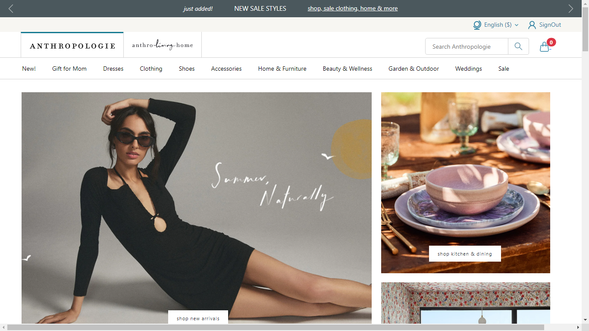
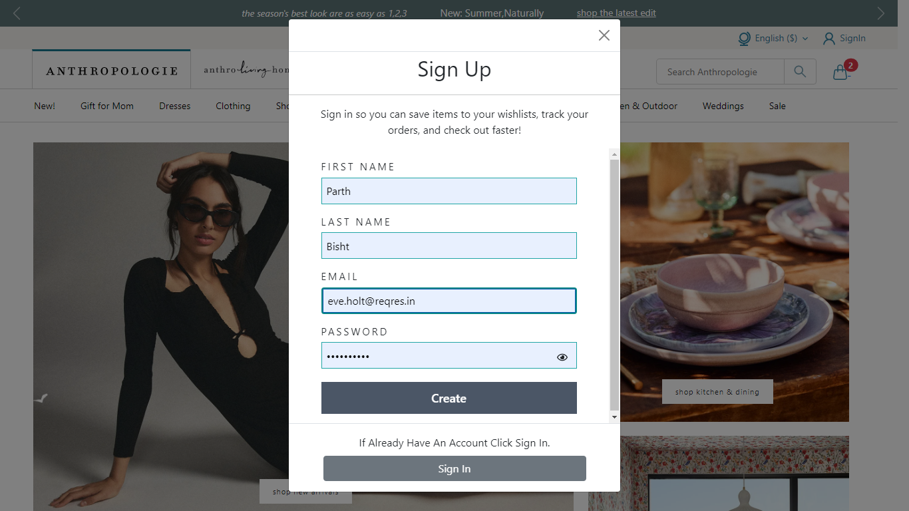
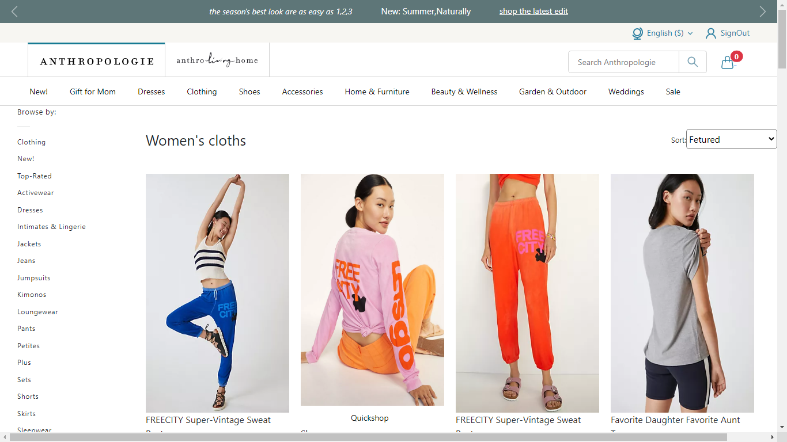
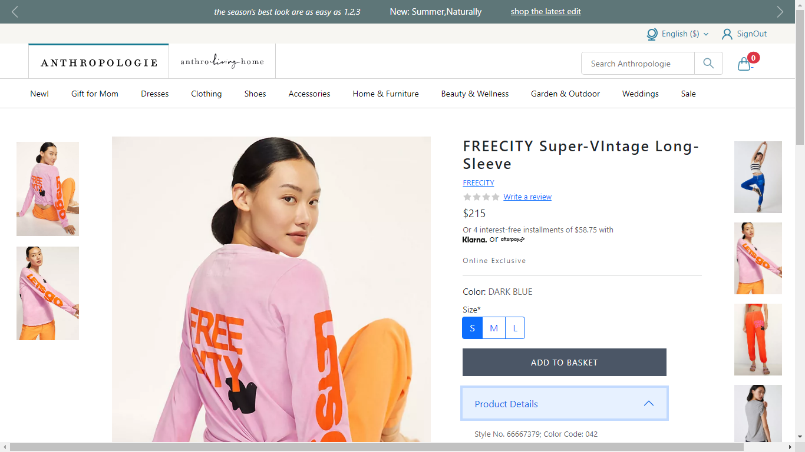
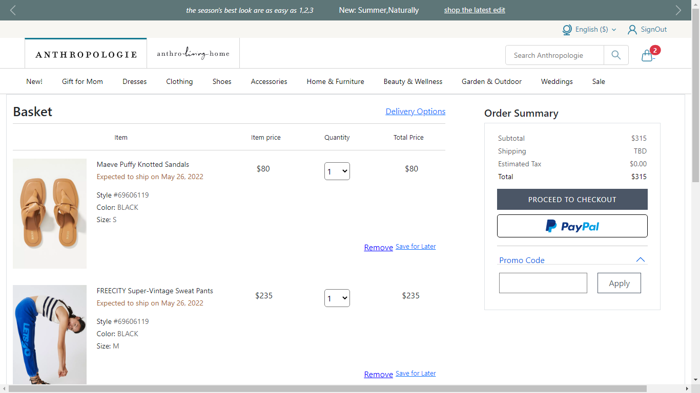

# Anthropologie.com

Anthropologie was founded by current URBN chairman and president Dick Hayne, having heard the plea of a friend. She had just moved to the suburbs of Philadelphia, and was dissatisfied with the shopping options available to her. Now a distance from Urban Outfitters—a brand she also was aging out of—there was a void in her life. She longed for a store to indulge her creative side. Dick, realizing this wasn't an isolated phenomenon, went on to build a lifestyle brand that catered to creative, educated and affluent 30-45 year-old women. Named after his college major (but with a decidedly French twist), Anthropologie opened its very first doors in the autumn of 1992 in Wayne, Pennsylvania. We now operate over 200 stores worldwide.

# Anthropologie clone

<h2>Landing Page</h2>

<h2>Login Page</h2>

<h2>Product Page</h2>

<h2>Single Product Page</h2>

<h2>Cart Page</h2>

<h1>[Getting Started]</h1>
    <h3>Execution</h3>
    
If you want to run our project in your local machine

    
Follow the given steps:

    <ul>
        <li>Clone our respository </li>
        <li>Open our code in VS code</li>
        <li>On your terminal just write the command npm install</li>
        <li>Initialize the server by writing 'npm run server' on Terminal</li>
        <li>Than you can navigate to our website.</li>
    </ul>
        <h1>Built with</h1>
    <ul>
        <li>React.JS</li>
        <li>Bootstrap</li>
        <li>Node.JS</li>
    </ul>

<h1>Creators</h1>
<ul>
    <li><a href="https://github.com/Parth-Bisht">@Parth Bisht</a></li>
    <li> <a href="https://github.com/kavish729">@Kavish Chittora</a> </li>
        <li><a href="https://github.com/ShivamRathore07">@Shivam Rathore</a></li>
        <li><a href="https://github.com/SonaliBhalerao">@Sonali Bhalerao</a></li>
        <li><a href="https://github.com/naushadcom">@Md Naushad Ahamed</a></li>
        <li><a href="https://github.com/Suhani1102">@Suhani</a></li>
</ul>

